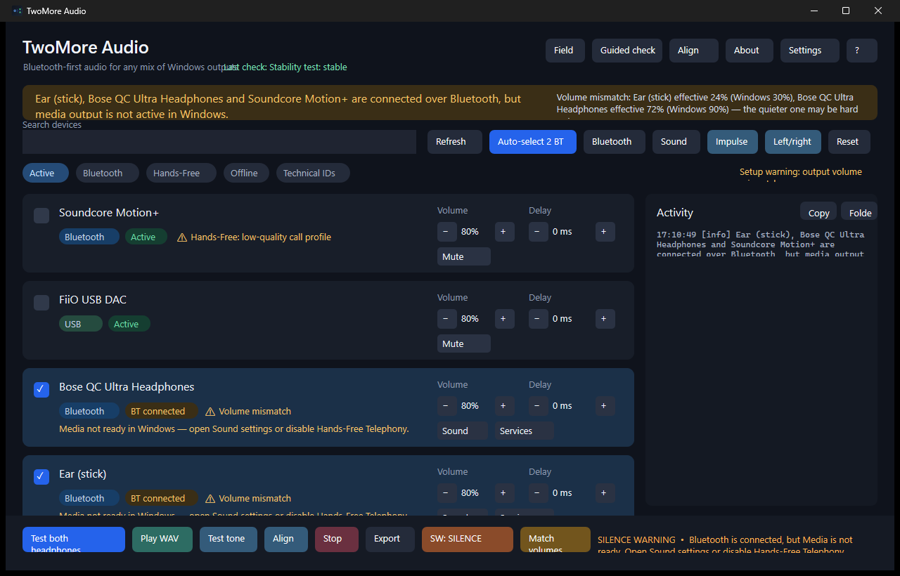
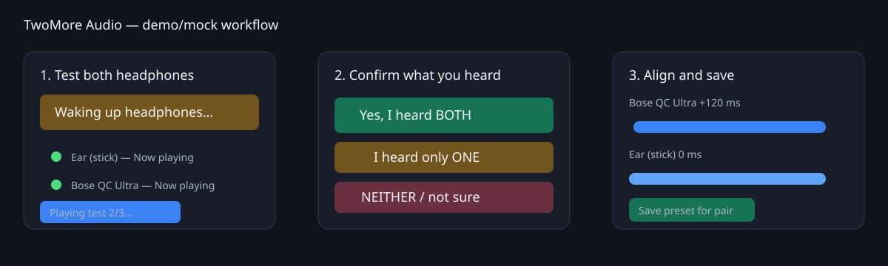
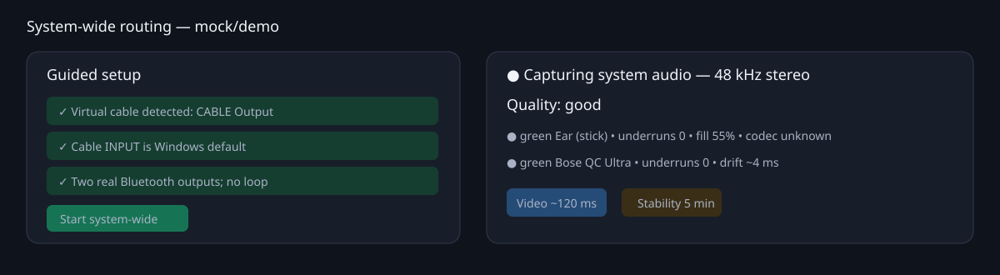

# TwoMore Audio

Native Windows audio routing for two or more independently connected output
devices.

TwoMore Audio is a closed-source product. This public repository contains the
user documentation, screenshots, and compiled Windows releases; the source
code is intentionally not distributed.

## Download

Get the latest build from the [GitHub Releases page](https://github.com/Spar2/TwoMore_Audio/releases/latest).

- **Portable ZIP** — unpack it and run `twomore-gui.exe`.
- **SHA-256 file and JSON manifest** — verify the exact artifact contents.

The current verified distribution is portable. A signed installer may be
published separately after its Windows installation and upgrade path has been
validated.

## What it does

- Routes audio to multiple Bluetooth, wired, USB, or HDMI outputs.
- Provides per-device gain, mute, delay, health, and quality indicators.
- Follows bounded endpoint-clock drift during long sessions.
- Recovers from endpoint churn and reports which device stopped a session.
- Includes guided checks, a system Audio control center, and a quiet-cable
  rescue path for virtual-cable capture.

## Preview

## First launch

1. Pair and connect the desired Bluetooth **Media** endpoints in Windows.
2. Start `twomore-gui.exe` and run the guided device check.
3. Select the outputs, run the test signal, and confirm what you actually
   heard.
4. For system-wide routing, install VB-CABLE or Voicemeeter separately from
   its official vendor and follow the in-app setup check.

Hands-Free endpoints are intended for calls and normally provide lower-quality
mono audio. Select the Media endpoint for music and video.

## Privacy and limitations

Audio processing is local. TwoMore Audio does not upload recordings or bundle a
virtual audio driver. Independent Bluetooth radios have independent clocks and
buffering, so the product reduces drift and exposes observed health but does
not promise perfect acoustic phase alignment, codec selection, automatic
pairing, or DRM bypass.

## Documentation

- [GUI guide](docs/gui.md)
- [System-wide routing](docs/systemwide.md)
- [Quality monitoring](docs/quality.md)
- [Troubleshooting](docs/troubleshooting.md)
- [Diagnostics and privacy](docs/diagnostics.md)
- [Release notes](docs/release-notes.md)

## License

The binaries are proprietary software. See [LICENSE](LICENSE) for the binary
license and [third-party notices](THIRD_PARTY_NOTICES.md) for optional products
mentioned in the documentation.

